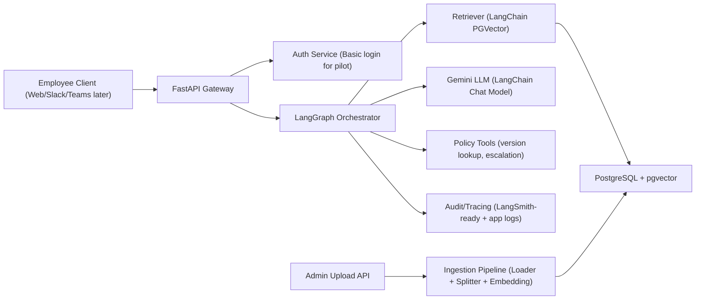
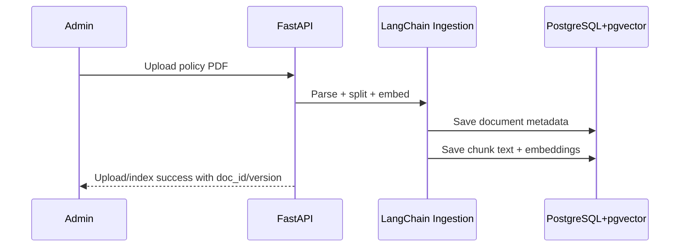
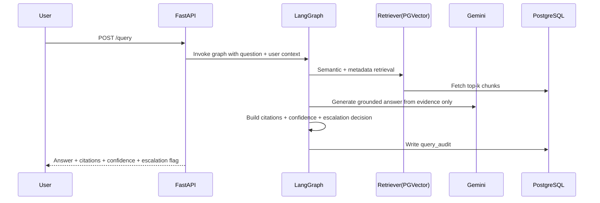

# Enterprise Employee Policy Search (RAG) - End-to-End Design Document

## 1. Topic Overview
This project is a Generative AI-powered enterprise assistant that helps employees ask natural-language questions about company policies (leave, insurance, HR guidelines) and receive accurate, citation-backed answers.

The system uses Retrieval-Augmented Generation (RAG) so responses are grounded in official policy documents instead of pure model memory.

## 2. Business Use Cases
1. Leave policy Q&A  
Employee asks: “How many casual leaves can I carry forward?”

2. Insurance coverage clarification  
Employee asks: “Does parental insurance cover day-care procedures?”

3. Policy version awareness  
Employee asks: “What changed in WFH policy this quarter?”

4. HR escalation guidance  
When evidence is weak or conflicting, system responds with “insufficient evidence” and routes employee to HR contact path.

## 3. Objectives
1. Provide trustworthy answers with source citations.
2. Reduce HR support load for repetitive questions.
3. Make policy access fast, conversational, and searchable.
4. Keep architecture API-first so Slack/Teams adapters can be added later.
5. Maximize GenAI framework usage with LangChain + LangGraph.

## 4. High-Level Architecture

## 5. Core Components
1. API Layer (FastAPI)  
Handles auth, document upload, query endpoints, health checks.

2. Ingestion Pipeline (LangChain)  
Uses PDF loader, text splitter, embedding model, and persists chunks to PostgreSQL `pgvector`.

3. Vector + Metadata Store (PostgreSQL + pgvector)  
Stores document metadata, chunk text, embeddings, versions, and query audit records.

4. Orchestration Layer (LangGraph)  
Implements deterministic query workflow as graph nodes:
- Normalize query
- Route policy domain
- Retrieve evidence
- Grade evidence
- Generate grounded answer
- Format citations
- Decide escalation

5. LLM and Tools Layer  
Gemini via LangChain wrappers, plus tool nodes for policy-version lookup and escalation path guidance.

6. Observability Layer  
Request tracing, retrieval diagnostics, latency, citation coverage, and insufficient-evidence rates.

## 6. Logical Data Model
1. `documents`  
`doc_id`, `title`, `policy_type`, `version`, `effective_date`, `status`, `uploaded_by`, `uploaded_at`

2. `chunks`  
`chunk_id`, `doc_id`, `chunk_text`, `page`, `section`, `embedding vector`, `version`, `policy_type`

3. `query_audit`  
`request_id`, `user_id`, `question`, `retrieved_doc_ids`, `response_summary`, `confidence`, `latency_ms`, `created_at`

## 7. End-to-End Flows

### 7.1 Ingestion Flow

### 7.2 Query Flow

## 8. API Surface (v1)
1. `POST /auth/login`
2. `POST /auth/refresh`
3. `POST /documents/upload`
4. `GET /documents`
5. `GET /documents/{id}`
6. `POST /query`
7. `GET /health`
8. `GET /ready`

`/query` response schema:
- `answer`
- `citations[]` with `doc_id/title/page/section/snippet/version`
- `confidence`
- `escalation_required`
- `follow_up_questions[]`
- `request_id`

## 9. Security and Governance (Pilot Baseline)
1. Basic login with token-based session.
2. API route protection for upload/admin operations.
3. Audit logs for every query and retrieved evidence.
4. Strict grounded-answer policy to reduce hallucinations.
5. “Insufficient evidence” fallback + HR escalation guidance.

----
